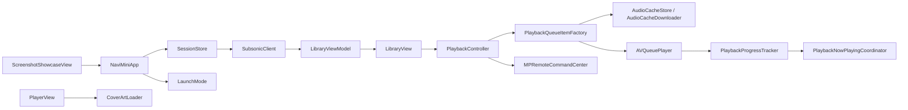

# NaviMini 架构说明与技术方案

## 1. 项目目标

NaviMini 是一个面向个人音乐库的 iOS 在线播放器，服务端兼容 Navidrome 和 Subsonic REST API。

当前版本的目标很明确：

- 保留能正常播放的主链路
- 尽量减少状态分叉和自动修复逻辑
- 让播放、进度、封面、快捷指令这些核心能力可以稳定工作

当前不做的事情：

- 封面缓存
- 歌曲列表缓存
- 自动回退和离线播放
- 复杂播放队列管理

## 2. 功能边界

### 已实现功能

- 通过 `SessionStore` 维护固定会话配置
- 使用 `ping` 验证服务可达
- 通过 `search3` 拉取歌曲列表
- 列表分页加载，滚动到底自动加载更多
- 点击歌曲开始播放
- 顺序、随机、单曲循环三种播放模式
- 上一首、下一首、播放 / 暂停
- 手动拖动进度条并 seek
- `AVQueuePlayer` 播放
- 后台音频会话
- 锁屏和控制中心控制
- Now Playing 信息同步
- 远程封面加载
- App Intents 和快捷指令
- 用于截图和文档展示的 LaunchMode 分支

### 现阶段限制

- 没有独立登录页
- 没有离线能力
- 没有播放下载管理
- 没有专辑页、歌手页、完整搜索页、收藏页
- 没有复杂容错或自动修复路径

## 3. 模块划分

| 模块             | 职责                                        | 关键文件                                                                                                                                                                                                                                                                    |
| ---------------- | ------------------------------------------- | --------------------------------------------------------------------------------------------------------------------------------------------------------------------------------------------------------------------------------------------------------------------------- |
| `App/`           | 启动、会话配置、快捷指令、展示模式切换      | `NaviMiniApp.swift`, `SessionStore.swift`, `ShortcutsIntents.swift`, `LaunchMode.swift`                                                                                                                                                                                     |
| `Models/`        | 领域模型                                    | `Song.swift`                                                                                                                                                                                                                                                                |
| `Subsonic/`      | API 客户端与响应模型                        | `SubsonicClient.swift`, `SubsonicModels.swift`                                                                                                                                                                                                                              |
| `ViewModels/`    | 视图状态和分页加载                          | `LibraryViewModel.swift`                                                                                                                                                                                                                                                    |
| `Views/`         | SwiftUI 页面                                | `LibraryView.swift`, `PlayerView.swift`, `ScreenshotShowcaseView.swift`                                                                                                                                                                                                     |
| `Playback/`      | 播放控制、队列、进度、Now Playing、系统集成 | `PlaybackController.swift`, `PlaybackQueueLogic.swift`, `PlaybackQueueItemFactory.swift`, `PlaybackProgressTracker.swift`, `PlaybackNowPlayingCoordinator.swift`, `PlaybackController+SystemIntegration.swift`, `PlaybackController+TimeMonitoring.swift`, `PlayMode.swift` |
| `Storage/`       | 音频缓存、封面加载、日志                    | `AudioCacheStore.swift`, `AudioCacheDownloader.swift`, `CoverArtLoader.swift`, `MetricsLogger.swift`                                                                                                                                                                        |
| `NaviMiniTests/` | 基础回归测试                                | `PlaybackQueueLogicTests.swift`, `PlaybackQueueItemFactoryTests.swift`, `LibraryViewModelTests.swift`                                                                                                                                                                       |

## 4. 运行时数据流

运行过程可以理解为：

1. App 启动后创建 `SessionStore` 和 `PlaybackController`。
2. `LibraryView` 触发 `LibraryViewModel.refresh(client:)`，拉取歌曲列表。
3. 用户点歌后，`PlaybackController` 根据当前队列构建 `AVPlayerItem`，并优先尝试命中本地音频缓存。
4. `PlaybackProgressTracker` 负责时间观察、进度同步、日志记录。
5. `PlaybackNowPlayingCoordinator` 更新锁屏和控制中心信息。
6. `PlayerView` 负责交互层，封面和进度都只做展示，不做额外状态源。

## 5. 技术方案

### 5.1 会话与 API 访问

`SessionStore` 负责集中管理服务地址、用户名和密码。当前实现没有独立登录流程，应用直接基于这组配置连接服务端。

`SubsonicClient` 负责构建全部 API URL，核心接口包括：

- `ping`
- `searchAllSongs`
- `streamURL`
- `coverArtURL`

#### 选择理由

- 配置集中，调用面简单
- 客户端层没有状态耦合，便于在 ViewModel 和 Playback 层复用

#### 风险

- 没有登录 UI，切换账号需要改代码
- 认证信息不适合长期放在源码里，后续最好改成 Keychain 或配置注入

### 5.2 列表加载

`LibraryViewModel` 使用分页拉取歌曲列表，并维护：

- `songs`
- `isRefreshing`
- `isLoadingMore`
- `hasMore`
- `errorText`

刷新时会先通过指数探测方式估算总歌曲数，再拉取第一页数据。

#### 选择理由

- 列表分页对大资料库更稳
- 视图只关心状态，不直接碰 API

#### 风险

- 总数探测会产生额外请求
- 网络差时刷新路径会变慢

### 5.3 播放控制

`PlaybackController` 是播放状态的单一入口，负责：

- 当前歌曲、队列、索引和播放模式
- `AVQueuePlayer` 的重建和播放切换
- `next` / `prev` / `seek` / `togglePlayPause`
- repeat-one 行为
- 锁屏和控制中心状态更新
- 远程控制命令响应

`PlaybackQueueItemFactory` 负责根据歌曲和流格式决定播放来源：

- 命中完整音频缓存时返回本地 `AVPlayerItem`
- 未命中时返回远端流 `AVPlayerItem`
- 同时触发后台缓存下载

`AudioCacheStore` 负责缓存文件命名、完整性检查、落盘与淘汰。

`AudioCacheDownloader` 负责异步下载和同一缓存键的并发去重。

#### 选择理由

- 播放逻辑集中，便于排查
- 音频缓存只接入播放链路，不扩散到列表和封面，状态面仍然可控

#### 风险

- 未命中缓存时仍依赖远端流
- `AVQueuePlayer` 重新构建队列会带来切歌时的状态重置成本

### 5.4 进度同步

`PlaybackProgressTracker` 负责：

- 每秒更新进度
- 同步 `MPNowPlayingInfoCenter`
- 记录访问日志和播放日志
- 对进度做投影展示，保证 UI 在播放时平滑前进

`PlaybackQueueLogic` 只保留基础算法：

- 下一首索引
- 播放时长归一化
- 当前进度投影

#### 选择理由

- 进度同步和 UI 解耦
- 只保留必要算法，减少误判和自动跳转

#### 风险

- 没有自动回退后，流媒体异常只能靠播放器自身状态暴露

### 5.5 封面加载

`CoverArtLoader` 直接通过 `URLSession.shared.data(from:)` 拉取封面并转换成 `UIImage`。

`PlaybackNowPlayingCoordinator` 和 `PlayerView` 都使用这条直连路径。

#### 选择理由

- 简单
- 没有缓存一致性问题

#### 风险

- 切换歌曲时会重复请求封面
- 网络波动会直接反映到 UI

### 5.6 音频缓存

当前版本已经实现音频磁盘缓存，核心行为如下：

- 缓存目录默认位于 `Library/Caches/AudioCache`
- 缓存键由 `songId + formatKey + originalFileExtension` 组成
- 命中要求文件存在且大小大于 0
- 下载落盘时会校验文件大小，必要时根据 `expectedContentLength` 判断完整性
- 默认最大缓存大小为 8 GB
- 超限后按修改时间清理旧文件

#### 选择理由

- 重复播放同一歌曲时可直接命中本地文件
- 不改变首播主路径，未命中时仍然直接在线播放
- 落盘和淘汰逻辑集中在 `Storage/`，边界清晰

#### 风险

- 这不是离线播放，首次播放和缓存未命中时仍然依赖网络
- 淘汰策略是按修改时间近似清理，不是严格 LRU
- 当前没有覆盖封面和列表缓存，资源体验仍不一致

### 5.7 系统集成

`PlaybackController+SystemIntegration.swift` 负责：

- 配置 `AVAudioSession`
- 处理音频中断
- 响应 `MPRemoteCommandCenter`

`ShortcutsIntents.swift` 暴露以下快捷指令：

- 播放 / 暂停
- 继续播放
- 开始播放
- 下一首
- 上一首
- 随机播放当前列表

#### 选择理由

- 直接接系统框架，路径短
- 快捷指令复用同一套播放控制逻辑

#### 风险

- 快捷指令行为受系统可发现性影响
- 后台和中断场景仍依赖系统状态稳定性

### 5.8 日志

`MetricsLogger` 把日志写到文档目录下的 `metrics.log`，同时输出到控制台。

#### 选择理由

- 排查播放器问题时能快速定位到具体行为

#### 风险

- 日志是长期累积文件，后续需要做轮转或清理策略

## 6. 设计取舍

| 取舍           | 优势                     | 风险                             |
| -------------- | ------------------------ | -------------------------------- |
| 在线直连流播放 | 逻辑最短，状态最少       | 依赖网络，离线不可用             |
| 音频磁盘缓存   | 重复播放可直接命中本地   | 首次播放或未命中时仍依赖网络     |
| 不做自动回退   | 不会出现误切歌、误降级   | 播放异常时只能暴露错误而不是自愈 |
| 固定会话配置   | 启动路径简单，调用方少   | 不适合多账号切换                 |
| 单一播放控制器 | 状态集中，便于维护       | 控制器变大，修改要谨慎           |

## 7. 测试策略

当前测试的目标不是覆盖全部 UI，而是守住几个最容易退化的纯逻辑点：

- `PlaybackQueueLogicTests`：时长与进度算法
- `PlaybackQueueItemFactoryTests`：队列项是否生成远程流 URL
- `LibraryViewModelTests`：分页初始化逻辑

### 当前测试策略的优势

- 纯逻辑测试运行快
- 对回归最敏感的地方有最小保护

### 当前测试策略的风险

- 没有完整 UI 测试
- 没有端到端网络测试
- 没有模拟播放器失败场景

## 8. 后续扩展建议

如果继续扩展，建议按这个顺序做：

1. 把 `SessionStore` 改成真正的配置入口，补登录页或配置页
2. 增加专辑、歌手、搜索和收藏能力
3. 做播放队列管理和更细的进度控制
4. 视需要补充封面或列表缓存，但保持音频缓存边界清晰
5. 扩大测试范围，补 UI 和网络层回归

## 9. Design Context

产品定位与设计原则见根目录 [`PRODUCT.md`](PRODUCT.md)。视觉系统（颜色、字体、组件、禁忌）见 [`DESIGN.md`](DESIGN.md)。后续 UI 改动以这两份文件为准；`AGENTS.md` 只保留架构与技术方案。
