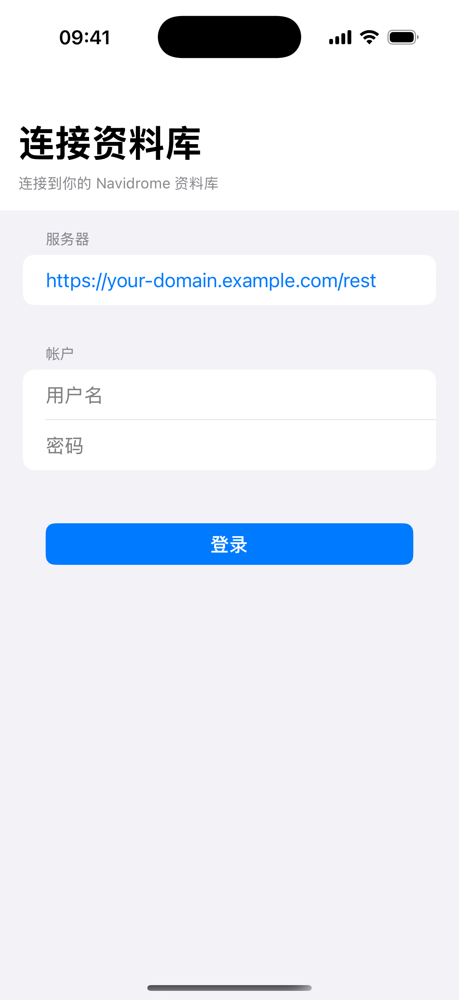
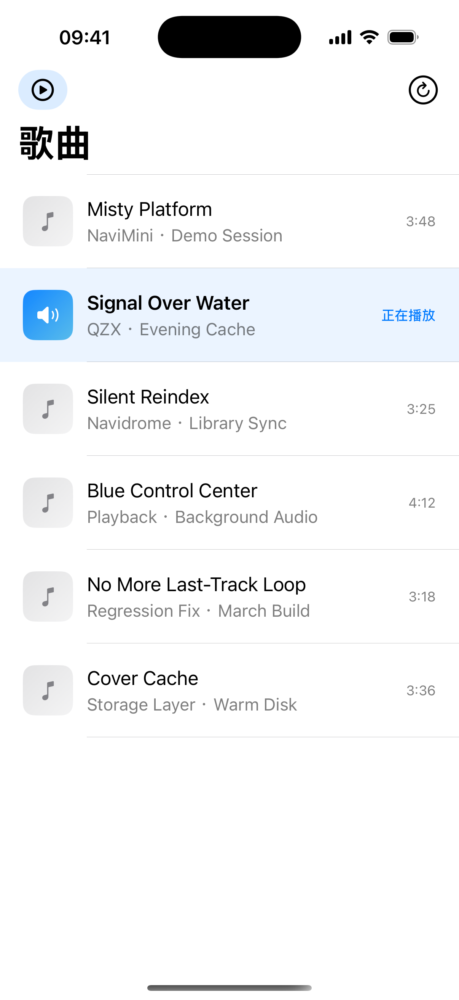
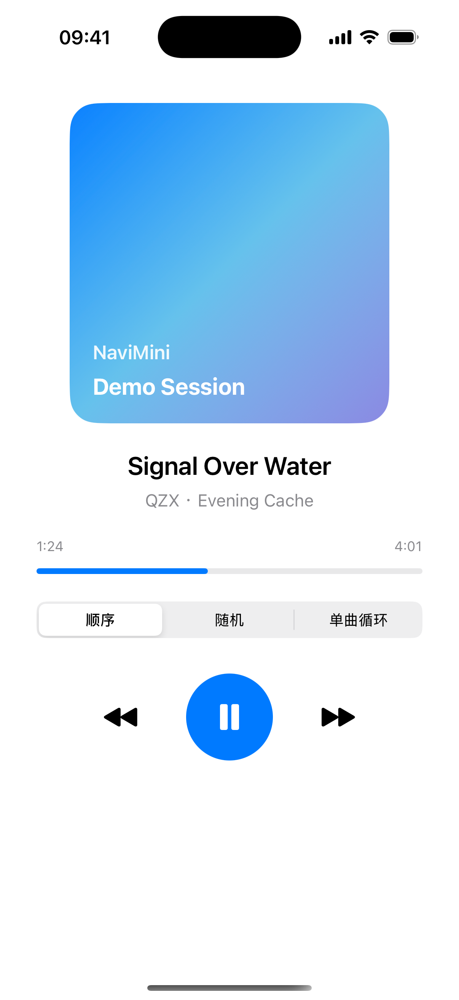

# NaviMini

NaviMini 是一个面向个人音乐库的 iOS 客户端，使用 SwiftUI 构建，服务端兼容
Navidrome 和 Subsonic REST API。

这个项目当前的定位不是完整的流媒体产品，而是一个已经打通核心链路的 iOS MVP：

- 通过 `SessionStore` 的固定会话配置连接自己的 Navidrome 服务
- 拉取歌曲列表并分页加载
- 顺序播放、随机播放、单曲循环
- 上一首、下一首、播放 / 暂停、拖动进度条
- 后台播放、锁屏控制、Now Playing 信息
- 远程流播放、音频磁盘缓存与封面直连加载
- 基础快捷指令 / App Intents
- 用于文档截图的展示模式

## 界面预览

| 连接示意                                  | 歌曲列表                                    | 播放器                                   |
| ----------------------------------------- | ------------------------------------------- | ---------------------------------------- |
|  |  |  |

## 当前状态

**项目已可编译、可运行，并包含最小单元测试。**

当前更适合：

- 自建 Navidrome 资料库的个人使用
- 作为 SwiftUI + AVFoundation + Subsonic API 的参考项目
- 后续继续扩展专辑、搜索、播放队列、下载管理
- 作为“在线播放优先、仅音频做磁盘缓存”的最小播放器实现参考

当前还不适合：

- 直接作为“功能完整”的音乐播放器发布
- 依赖离线播放、本地缓存、复杂降级能力的场景
- 把所有 Subsonic 兼容行为都视为已覆盖

## 已实现能力

### 核心链路

- 通过 `SessionStore` 统一管理服务器地址、用户名、密码
- 使用 `ping` 验证服务可达性
- 使用 `search3` 拉取歌曲列表
- 列表分页加载，滚动到底部自动加载更多
- 点击歌曲开始播放
- 顺序、随机、单曲循环三种模式
- 上一首、下一首、播放 / 暂停
- 手动拖动进度条并 seek
- 当前播放项切换时自动同步列表高亮和滚动位置

### 播放体验

- `AVQueuePlayer` 播放
- 后台音频会话
- 锁屏 / 控制中心媒体控制
- 播放结束后的模式切换逻辑
- 切歌时校正系统播放时间显示
- 队列尾部停止，不再错误重播最后一首
- 当前播放时长优先来自播放器时间，必要时回退到元数据时长
- Now Playing 信息同步标题、艺术家、专辑、时长和播放进度

### 资源与系统集成

- 远程封面加载
- App Intents
- 快捷指令入口
- 基础播放控制命令
- 截图展示模式，便于生成文档和预览图

## 技术栈

- Swift 5
- SwiftUI
- AVFoundation
- MediaPlayer
- App Intents
- XcodeGen

## 环境要求

- macOS
- Xcode 16 或更高版本
- iOS 17.0 或更高版本
- 一个可访问的 Navidrome 服务

## 快速开始

### 1. 克隆仓库

```bash
git clone https://github.com/qinchaomeishenmeshi/NaviMini.git
cd NaviMini
```

### 2. 生成工程

这个仓库使用 `project.yml` 管理工程定义。若你修改了工程配置，先重新生成
`.xcodeproj`：

```bash
xcodegen generate
```

如果你本机已存在 Ruby 环境，也可以使用：

```bash
ruby update_xcode.rb
```

### 3. 打开工程

用 Xcode 打开：

```bash
open NaviMini.xcodeproj
```

### 4. 运行 App

应用当前没有独立登录页。要连接自己的资料库，请修改
`NaviMini/App/SessionStore.swift` 中的 `baseURLString`、`username` 和 `password`
后重新运行。

如果你的 Navidrome 部署地址不是 `/rest` 结尾，先确认你填入的是实际可用的
Subsonic REST 根路径。这个客户端当前不会替你做路径纠正。

## 测试与验证

运行单元测试：

```bash
xcodebuild test \
  -project NaviMini.xcodeproj \
  -scheme NaviMini \
  -destination 'platform=iOS Simulator,name=iPhone 16 Pro,OS=18.6'
```

构建验证：

```bash
xcodebuild build \
  -project NaviMini.xcodeproj \
  -scheme NaviMini \
  -destination 'platform=iOS Simulator,name=iPhone 16 Pro,OS=18.6'
```

## 项目结构

```text
NaviMini/
├── App/            # 会话状态、快捷指令
├── Models/         # 领域模型
├── Playback/       # 播放控制、播放模式、队列逻辑、Now Playing
├── Storage/        # 音频缓存、封面加载与日志
├── Subsonic/       # API 客户端与模型
├── ViewModels/     # 页面状态管理
└── Views/          # SwiftUI 界面
```

测试代码位于：

- `NaviMiniTests/`

## 已知限制

- 当前媒体库能力仍偏薄，主要围绕“歌曲列表 + 播放”展开
- 还没有专辑页、歌手页、完整搜索、播放队列管理
- 自动化测试覆盖面有限，目前只有最小回归测试
- App Intents 已接入，但系统侧的可发现性和完整集成仍可继续完善
- 某些服务端元数据质量差时，时长、封面、转码行为仍受服务端返回影响
- 当前不做离线播放、封面缓存、列表缓存或自动回退

## 缓存说明

当前缓存策略是分层的，不是“完全无缓存”：

- 音频：有磁盘缓存，命中时直接播放本地文件
- 封面：无项目级缓存，按 URL 直连加载
- 列表：无持久化缓存，刷新和分页都直连 API
- 日志：写入 `metrics.log`，仅用于观测，不参与读取命中

更完整的实现说明见：

- [docs/cache-architecture.md](docs/cache-architecture.md)

## 开发重点

如果继续往产品方向推进，优先级应该是：

1. 补全专辑、歌手、搜索、收藏等媒体库能力
2. 增加更完整的播放队列与播放进度控制
3. 扩大测试覆盖，降低回归风险
4. 继续收敛配置和网络异常时的错误体验
5. 完善快捷指令和系统集成

## License

本仓库使用 [MIT License](LICENSE)。

这意味着你可以自由使用、修改和分发代码，但软件按“现状”提供，不附带担保。
