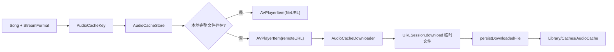

# NaviMini 当前缓存架构说明

## 1. 结论

当前项目**已经实现音频磁盘缓存**，并且这条链路已经接入实际播放流程。

但以下能力**仍未实现项目级缓存**：

- 封面缓存
- 歌曲列表缓存
- Subsonic API 响应缓存

因此，当前缓存策略的准确定义应该是：

- **音频：有磁盘缓存**
- **封面：直连加载**
- **列表：直连请求**
- **日志：落盘，但不是缓存**

## 2. 缓存边界

### 2.1 已实现

#### 音频缓存

播放前会优先检查本地是否已有对应歌曲和流格式的完整缓存文件：

- 命中时直接使用本地文件创建 `AVPlayerItem`
- 未命中时使用远端流地址播放
- 同时异步启动后台整首下载

相关实现：

- `NaviMini/Playback/PlaybackQueueItemFactory.swift`
- `NaviMini/Storage/AudioCacheStore.swift`
- `NaviMini/Storage/AudioCacheDownloader.swift`

### 2.2 未实现

#### 封面缓存

`CoverArtLoader` 直接通过 `URLSession.shared.data(from:)` 拉取图片并转成 `UIImage`，没有项目内的：

- 内存缓存
- 磁盘缓存
- 去重下载
- 失效策略

#### 列表缓存

`LibraryViewModel.refresh` 和 `loadMore` 都直接调用 `SubsonicClient.searchAllSongs(...)`，列表数据只保存在当前进程内的 `songs` 状态里，App 重启后不会保留。

#### API 响应缓存

项目没有自定义 `URLCache`，也没有对 `ping`、`search3`、封面请求做响应持久化管理。

## 3. 音频缓存数据流

主流程对应实现：

1. `PlaybackQueueItemFactory.makeItem(...)` 计算当前歌曲应使用的流格式。
2. 通过 `songId + formatKey + originalFileExtension` 生成 `AudioCacheKey`。
3. 调用 `AudioCacheStore.cachedFileURLIfComplete(for:)` 检查缓存是否存在且非空。
4. 命中时直接返回本地 `AVPlayerItem`。
5. 未命中时返回远端 `AVPlayerItem`，并调用 `AudioCacheDownloader.ensureCached(...)` 启动后台下载。
6. 下载完成后通过 `AudioCacheStore.persistDownloadedFile(...)` 将文件移动到缓存目录。

## 4. 音频缓存的关键规则

### 4.1 Cache Key

缓存键由以下维度组成：

- `songId`
- `formatKey`
- `originalFileExtension`

其中：

- 默认有损流使用 `mp3_192`
- `sourceFormat == "flac"` 时优先走 `raw`
- 文件后缀会尽量保留为可播放扩展名，例如 `mp3`、`flac`

这意味着同一首歌的不同流格式不会互相覆盖。

### 4.2 存储目录

默认缓存目录是：

- `Library/Caches/AudioCache`

如果系统缓存目录不可用，则退回到 `temporaryDirectory`。

### 4.3 完整性判断

缓存命中不仅要求文件存在，还要求：

- 文件大小大于 0
- 读取文件属性成功

否则会被视为坏缓存并删除。

下载落盘时还会继续校验：

- 临时文件大小必须大于 0
- 如果响应里有 `expectedContentLength`，则文件大小必须匹配

### 4.4 并发控制

`AudioCacheDownloader` 使用 `AudioCacheInFlightRegistry` 保证：

- 同一个 `AudioCacheKey` 在同一时刻只会发起一个下载任务

避免重复下载同一首歌。

### 4.5 淘汰策略

`AudioCacheStore` 默认最大缓存大小为：

- `8 * 1024 * 1024 * 1024` 字节，即 **8 GB**

超过限制时：

- 读取缓存目录下所有文件
- 按修改时间从旧到新排序
- 删除最旧文件直到总大小回到阈值内
- 刚写入的新文件会被保护，不参与本轮淘汰

这是一种简化的近似 LRU 策略，但并不跟踪真实播放热度。

## 5. 播放层如何使用缓存

播放控制器会记录当前播放来源：

- `.remote`
- `.localCache`

这个来源会影响：

- 调试日志
- Ready-to-play 时的性能埋点
- `PlayerView` 中的“本地”标识

因此音频缓存并不是完全透明的后台能力，而是已经进入了播放状态表达。

## 6. 日志与缓存的关系

`MetricsLogger` 会把指标写入：

- `Documents/metrics.log`

这里记录的内容包括：

- `audio_cache_hit`
- `audio_cache_miss`
- `audio_cache_download_started`
- `audio_cache_download_finished`
- `audio_cache_download_failed`

这些日志用于观察缓存行为，但**日志文件本身不是缓存层**。

## 7. 当前方案的优势与风险

| 维度 | 优势 | 劣势（风险） |
| --- | --- | --- |
| 音频缓存接入方式 | 命中时直接本地播放，逻辑短 | 首次播放仍依赖网络，不能算离线 |
| 数据一致性 | 只缓存整首完成文件，坏文件会清理 | 没有内容哈希校验，完整性校验有限 |
| 性能控制 | 512MB 上限 + 自动淘汰，避免无限增长 | 淘汰按修改时间，不是精确 LRU |
| 资源覆盖范围 | 只给最关键的音频链路加速，复杂度低 | 封面和列表仍然每次直连，体验不一致 |
| 维护性 | 结构清晰，职责分离 | 文档若继续写“无缓存”，会误导后续维护者 |

## 8. 与旧说明的偏差

仓库里一些旧说明仍写着：

- “不做音频缓存”
- “无缓存”

这些表述**已经与当前代码不一致**。

更准确的描述应改为：

> 当前版本采用“在线播放优先 + 音频磁盘缓存”的策略；封面、列表和 API 响应仍然不做项目级缓存。
